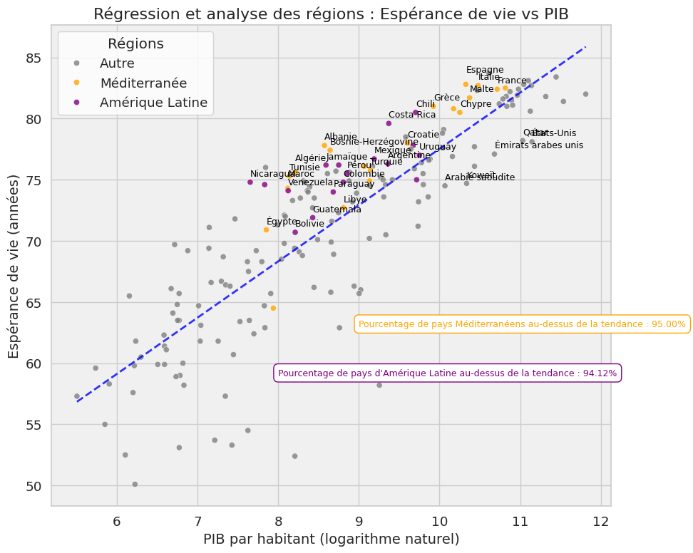

# 🌍 Analyse de l'Espérance de Vie vs PIB

## 📝 Vue d'ensemble du projet

Ce projet analyse la relation entre l'espérance de vie et le produit intérieur brut (PIB) par habitant dans différents pays. 
L'objectif est de mettre en évidence les pays qui surperforment en termes d'espérance de vie par rapport à leur richesse, avec un focus particulier sur les régions Méditerranée et Amérique Latine.

## 📊 Fonctionnalités principales

- **Analyse statistique** : Exploration des données d'espérance de vie et de PIB par habitant.
- **Visualisation avancée** : Génération de graphiques combinant régressions linéaires et analyses des résidus.
- **Focus régional** : Comparaison des performances des pays Méditerranéens et Latino-Américains avec d'autres régions.
- **Indicateurs clés** : Identification des pays "au-dessus de la tendance" et calcul des pourcentages de surperformance par région.

## 🚀 Pour commencer

### Prérequis

Pour exécuter ce projet, vous aurez besoin de :

- Python 3.x
- Les bibliothèques Python suivantes :
  - pandas
  - matplotlib
  - seaborn
  - numpy
  - scipy
  - scikit-learn

##  🔍 Détails de l'analyse

Le projet se concentre sur :

- Régression linéaire : Modélisation de la relation entre le logarithme du PIB par habitant et l'espérance de vie.
- Analyse des résidus : Identification des pays dont l'espérance de vie est supérieure ou inférieure aux prévisions du modèle.
- Comparaison régionale :
  - Analyse des résidus moyens pour les pays Méditerranéens, Latino-Américains et les autres.
  - Calcul des pourcentages de pays au-dessus de la tendance dans chaque région.
- Visualisation combinée : Intégration d'une ligne de régression, des points colorés par région, et des annotations pour les pays remarquables.

## 📈 Résultats clés

Les pays Méditerranéens et Latino-Américains se distinguent :
95 % des pays Méditerranéens et 94,12 % des pays Latino-Américains sont "au-dessus de la tendance".
Ces résultats indiquent que la grande majorité des pays de ces deux régions ont une espérance de vie nettement supérieure à ce que leur niveau de richesse économique laisserait présager.

*Figure 1 : Analyse de la relation entre l'espérance de vie et le PIB, avec un focus sur les régions Méditerranée et Amérique Latine.*

Le graphique illustre la corrélation globale entre l'espérance de vie et le PIB par habitant (logarithme naturel), ainsi que les performances des pays Méditerranéens (orange) et Latino-Américains (violet).
La ligne de régression permet de visualiser la tendance globale, tandis que les résidus mettent en évidence les pays surperformants ou sous-performants.

Test de normalité des résidus :
Le test de Shapiro-Wilk a été utilisé pour évaluer la normalité des résidus :
Statistique : 0.9387, p-value > 0.05.
Cela indique que les résidus suivent approximativement une distribution normale, ce qui valide l'utilisation de la régression linéaire pour analyser la relation entre PIB et espérance de vie.

**Facteurs possibles expliquant la surperformance** :

- Méditerranée :

  - Régime alimentaire : Le régime méditerranéen (riche en fruits, légumes, poisson, huile d'olive) est souvent cité comme un facteur clé pour la longévité et la réduction des maladies chroniques.
  - Accès aux soins : De nombreux pays méditerranéens bénéficient de systèmes de santé universels ou accessibles, offrant des soins de qualité à une large partie de leur population.
  - Mode de vie : Le climat tempéré, le lien social fort, et un rythme de vie équilibré favorisent une meilleure qualité de vie.

- Amérique Latine :

  - Solidarité sociale : Les sociétés latino-américaines sont souvent caractérisées par une forte solidarité communautaire, qui peut jouer un rôle dans la gestion du stress et des problèmes de santé mentale.
  - Politiques de santé publique : Certains pays (comme Cuba ou le Costa Rica) investissent massivement dans des systèmes de santé préventifs, garantissant une espérance de vie élevée malgré un PIB relativement faible.
  - Culture et famille : La famille joue un rôle central dans les sociétés latino-américaines, ce qui peut contribuer au bien-être global.

## 🔗 Ressources
Données sur l'espérance de vie : [Liste des pays par espérance de vie (Wikipedia)](https://fr.wikipedia.org/wiki/Liste_des_pays_par_esp%C3%A9rance_de_vie)
Données du PIB par habitant : [Liste des pays par PIB nominal par habitant (Wikipedia)](https://fr.wikipedia.org/wiki/Liste_des_pays_par_PIB_nominal_par_habitant)

